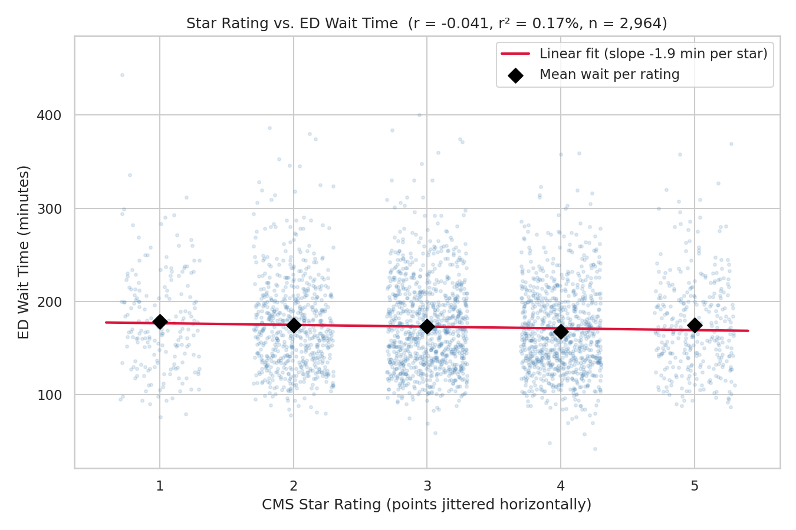
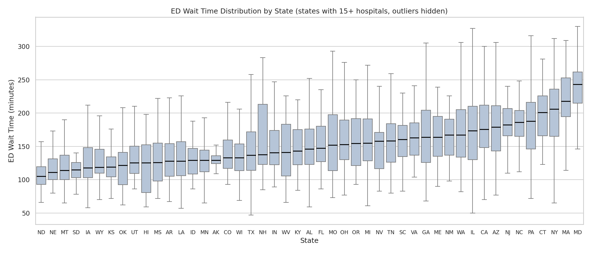
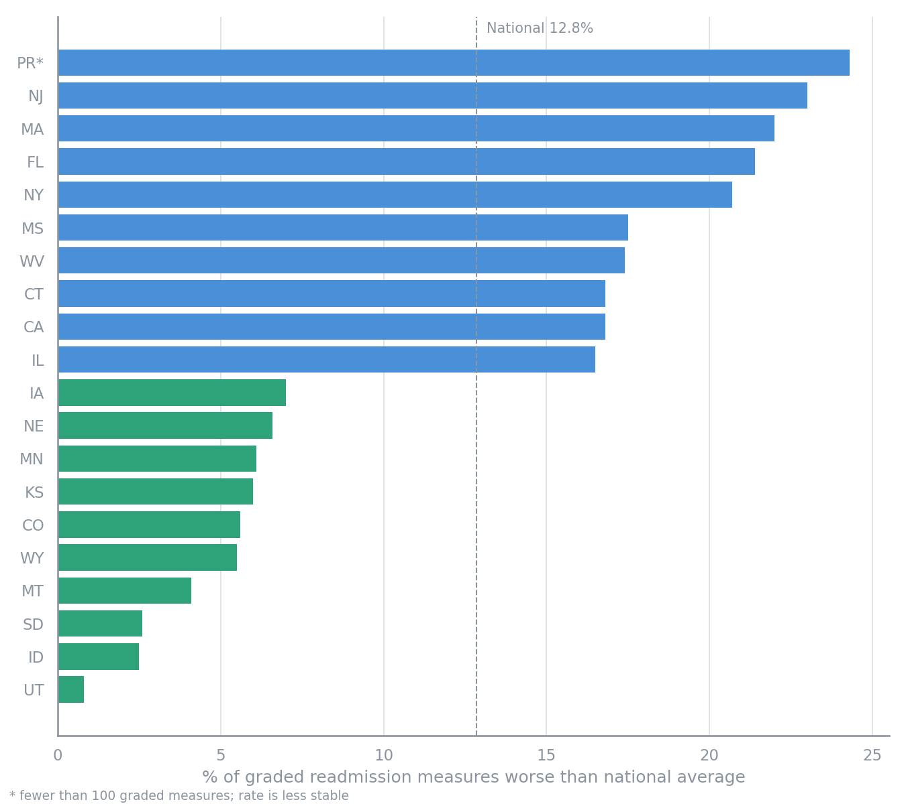

# U.S. Hospital ED Access & Quality Benchmarking (CMS Data)

## Live Artifacts

- **Tableau Public dashboard:** [ED Wait Time by State](https://public.tableau.com/app/profile/danny.lin4647/viz/EDWaitTimeByState/Dashboard1)
- **Analysis notebook:** [`notebook/cms_analysis.ipynb`](notebook/cms_analysis.ipynb)
- **Hospital scorecard:** [`outputs/view6_hospital_scorecard.csv`](outputs/view6_hospital_scorecard.csv)

---

## Business Problem

This analysis is written from the perspective of a regional health plan's network
management team, using publicly published CMS data.

A network management team reviews its contracted hospitals
when contracts come up for renewal and when deciding which hospitals to highlight to
members. CMS publishes the data needed to compare hospitals on emergency department
access and care quality, but it is spread across separate reporting files, and the
most visible summary metric, the CMS overall star rating, is easy to treat as a
stand-in for everything else.

This project consolidates CMS hospital data into a single SQL layer and answers three
questions for that team:

1. **Can CMS star ratings stand in for ED access** when comparing hospitals?
2. **What is the right comparison group** for a hospital's ED performance: the nation,
   its state, or its in-state peers?
3. **Where is readmission performance concentrated**, given CMS's Hospital Readmissions
   Reduction Program (HRRP) penalizes hospitals for excess readmissions?

## Project Goals

- Define a single, documented cohort rule for CMS quality measures and apply it the
  same way in every view.
- Produce an in-state benchmarking view a network team can use to compare a hospital
  against its local peers.
- Deliver a one-row-per-hospital scorecard that puts ED access and quality metrics
  side by side.

---

## Executive Summary

1. **Star rating does not predict ED wait time.** Across 2,964 rated hospitals, the
   correlation is r = -0.04; star rating explains 0.17% of the variation in ED wait.
   Average waits range only from 168 to 178 minutes across the five rating levels.
   110 of 318 five-star hospitals (34.6%) are in the slowest quarter of their state.
2. **Most variation in ED wait time is within states, not between them.** 72.8% of the
   variance sits between hospitals in the same state. In California, median ED waits
   range from 70 to 464 minutes.
3. **Readmission performance is concentrated in a few states.** Nationally, 12.8% of
   graded readmission measures are worse than the national average. New Jersey (23.0%),
   Massachusetts (22.0%), Florida (21.4%) and New York (20.7%) run well above that;
   Utah (0.8%), Idaho (2.5%) and South Dakota (2.6%) run well below it.

These findings show **where** performance differs. They do not show **why**.

---

## Architecture

```
CMS Provider Data Catalog
        │
        ▼
┌───────────────────────────┐
│   Raw Data (data/raw/)    │   Timely_and_Effective_Care-Hospital.csv
│                           │   HospInfo_2026.csv (current release)
│                           │   HospInfo.csv (older release, kept for comparison)
└─────────────┬─────────────┘
              │
      ┌───────┴───────────────────────────┐
      ▼                                   ▼
┌───────────────────────────┐   ┌───────────────────────────┐
│   SQL Layer (SQLite)      │   │   Python Layer (Jupyter)  │
│   00 cohort definitions   │   │   Re-derives the same     │
│   01 hospital attributes  │   │   cohort from raw files;  │
│   Views 1-6               │   │   correlation, variance   │
└─────────────┬─────────────┘   │   decomposition, charts   │
              ▼                 └───────────────────────────┘
┌───────────────────────────┐
│   outputs/ (CSV)          │
└─────────────┬─────────────┘
              ▼
┌───────────────────────────┐
│   Tableau Public          │
└───────────────────────────┘
```

The notebook reads the raw files directly rather than the SQL outputs. It serves as an
independent second path to the same numbers; both paths produce the same cohort counts
and results.

**Tools:** SQLite (DB Browser for SQLite), Python (pandas, SciPy, seaborn), Tableau Public.

---

## Data Sources

| File | Contents | Period |
|---|---|---|
| `Timely_and_Effective_Care-Hospital.csv` | One row per hospital per measure (138,173 rows, 4,660 facilities) | OP_18b and SEP_1: Jul 2024 - Jun 2025 |
| `HospInfo_2026.csv` | CMS Hospital General Information: star rating, hospital type, ownership, readmission measure counts (5,419 hospitals) | Last modified 2026-07-22, released 2026-08-13 |
| `HospInfo.csv` | Older Hospital General Information release | Not reliably dated; kept to document the comparison below |

**Measures used**

- **OP_18b:** median time from ED arrival to departure, in minutes.
- **SEP_1:** percentage of sepsis cases receiving the full recommended care bundle.
- **Readmission measure counts:** for each hospital, how many readmission measures CMS
  graded and how many came back better than, no different from, or worse than the
  national average.

## Metric Definitions

All cohort rules live in [`sql/00_cohort_definitions.sql`](sql/00_cohort_definitions.sql)
so every view uses the same population.

| Decision | Rule | Why |
|---|---|---|
| Valid score | Score is numeric | CMS reports suppressed or missing values as "Not Available" |
| Minimum sample | Sample >= 30 patients, for every measure | One threshold, applied consistently; below 30, a hospital's score is too unstable to compare |
| No upper cap on sample | Large samples kept | Very large sample values reflect hospitals reporting all cases rather than a sample, not data errors. Removing them moved no state average by more than 2.5 minutes |
| Join key | CMS Certification Number (`Facility ID`) | Normalized in [`sql/01_hospinfo_current.sql`](sql/01_hospinfo_current.sql) so zero-padded and alphanumeric IDs match correctly |
| Readmission rate | Worse measures / graded measures | See the readmissions section below for why a hospital-level flag was rejected |

**Resulting cohort:** 4,073 hospitals with a valid OP_18b score; 4,064 match the current
Hospital General Information file; 2,964 of those have a star rating.

---

## Findings

### 1. Star rating is not a useful predictor of ED wait time



| Star rating | Hospitals | Mean ED wait (min) |
|---|---|---|
| 1 | 187 | 178 |
| 2 | 638 | 175 |
| 3 | 944 | 174 |
| 4 | 876 | 168 |
| 5 | 319 | 175 |

Pearson r = -0.041 (p = 0.027), r² = 0.17%. The p-value says the relationship is
unlikely to be exactly zero, but at this sample size even a tiny effect is detectable.
The r² is what matters for a decision: star rating explains almost none of the
difference between a fast ED and a slow one.

**How this finding changed during the project.** An earlier version joined 2024-25 ED
data to an older, undated Hospital General Information file and found r = -0.205. Of the
4,344 hospitals present in both files, 1,823 (42%) have a different star rating in the
current release. The earlier correlation reflected mismatched time periods, not a real
relationship. Updating the file also raised the join match rate from 95.2% to 99.8% of
valid ED hospitals.

### 2. Hospitals differ far more within states than between them



State averages range from 114.3 minutes (North Dakota) to 330.0 minutes (Washington, D.C.,
6 hospitals). But a variance decomposition shows 72.8% of all variation in ED wait sits
between hospitals in the same state. A state-level map, including the one in this
project's dashboard, hides most of the real differences.

[`sql/view4_hospital_rankings.sql`](sql/view4_hospital_rankings.sql) ranks every hospital
against the others in its state using `RANK() OVER (PARTITION BY state ...)`.

### 3. Readmission performance is concentrated in a few states



4,264 hospitals are graded on at least one readmission measure (Acute Care, Critical
Access and VA hospitals only). Nationally, 12.8% of graded measures are worse than the
national average.

**Why the metric counts measures, not hospitals.** A first version flagged a hospital as
"worse" if any of its graded measures was worse. That favors hospitals graded on fewer
measures:

| Measures graded | Hospitals flagged "worse" |
|---|---|
| 1 | 0.6% |
| 6 | 52.2% |
| 11 | 77.8% |

Critical Access Hospitals average 3.2 graded measures versus 7.4 for Acute Care, so rural
states looked better partly by construction. The measure-level rate removes that effect.
The same states still rank highest and lowest, but the gap between them is smaller than
the hospital-level flag suggested.

Puerto Rico has the highest rate (24.3%) but on only 70 graded measures, so its rate is
less stable than the states below it.

### Supporting view: sepsis care by hospital type

| Hospital type | Avg SEP_1 score | Hospitals |
|---|---|---|
| Critical Access | 67.6 | 170 |
| Acute Care | 63.1 | 2,633 |
| Acute Care - Department of Defense | 59.9 | 12 |

Critical Access Hospitals score higher on sepsis care at every sample threshold tested,
but the size of the gap depends on the threshold: 2.3 points at Sample >= 1, 2.9 at >= 20,
and 4.5 at >= 30. The direction is consistent; the magnitude is not.

---

## Recommendations

For a health plan network management team:

| Finding | What it means | Recommendation |
|---|---|---|
| Star rating does not predict ED wait (r = -0.04) | A directory or referral tool that uses star rating as shorthand for "good hospital" says nothing about ED access | Show ED wait (OP_18b) alongside star rating in provider directories and network reviews, as a separate dimension |
| 72.8% of ED wait variance is within states | Hospitals under the same state policy and payer environment differ widely | Benchmark hospitals against in-state peers ([View 4](sql/view4_hospital_rankings.sql)). Use the scorecard to flag bottom-quartile hospitals for review at contract renewal |
| Readmission performance concentrates in NJ, MA, FL, NY | Hospitals in these states carry concentrated HRRP penalty exposure | Prioritize post-discharge follow-up for members discharged from hospitals with worse-rated measures in these states |

### Hospital scorecard

[`sql/view6_hospital_scorecard.sql`](sql/view6_hospital_scorecard.sql) produces one row
per hospital (4,064 rows): star rating, ED wait, in-state rank, in-state quartile, sepsis
score and readmission measure rate. It deliberately has **no composite score**. Combining
these metrics into one grade would require weighting choices this data cannot justify,
so the scorecard shows them side by side and leaves the weighting to the reviewer.

### Next analysis

- **What explains the within-state spread?** Test whether hospital size, ED volume or
  ownership accounts for the 72.8% within-state variance. The current data shows the
  spread exists; it does not explain it.
- **Which conditions drive readmission ratings?** The current file reports counts of
  better and worse measures, not which conditions they cover. Condition-level
  readmission data would show where follow-up programs should focus.

---

## Limitations

- **Findings are descriptive.** They show where hospitals differ, not why. No finding
  here should be read as a cause.
- **Children's hospitals have no SEP_1 scores** (all 94 report "Not Available"), so the
  sepsis view covers Acute Care, Critical Access and Department of Defense hospitals only.
- **Long-term care hospitals are excluded.** They report a separate measure set with no
  ED or SEP_1 measures.
- **Star ratings and measure periods differ.** The star rating combines many measures with
  different reporting periods, so it cannot be matched exactly to the Jul 2024 - Jun 2025
  ED data.
- **Small groups are unstable.** States with few hospitals (for example D.C. with 6) and
  Puerto Rico's 70 readmission measures produce less reliable rates. In-state quartiles
  are left blank for states with fewer than 10 ranked hospitals.
- **9 of 4,073 ED hospitals** do not appear in the current Hospital General Information
  file and are excluded from views that need hospital attributes.

---

## Repository Structure

```
healthcare-cms-dashboard/
├── README.md
├── data/
│   └── raw/
│       ├── Timely_and_Effective_Care-Hospital.csv
│       ├── HospInfo_2026.csv
│       └── HospInfo.csv
├── sql/
│   ├── 00_cohort_definitions.sql
│   ├── 01_hospinfo_current.sql
│   ├── view1_ed_by_state.sql
│   ├── view2_sepsis_by_type.sql
│   ├── view3_rating_vs_wait.sql
│   ├── view4_hospital_rankings.sql
│   ├── view5_readmissions_by_state.sql
│   └── view6_hospital_scorecard.sql
├── outputs/
│   └── view1-6 CSV outputs
├── notebook/
│   └── cms_analysis.ipynb
└── docs/
    ├── ED_Wait_Time_By_State.twb
    └── screenshots/
```

## How to Reproduce

1. Open a new database in DB Browser for SQLite and import both raw CSVs as tables named
   `Timely_and_Effective_Care_Hospital` and `HospInfo2026`.
2. Run `sql/00_cohort_definitions.sql`, then `sql/01_hospinfo_current.sql`.
3. Run any view file in `sql/` and export the result to `outputs/`.
4. For the Python analysis, open `notebook/cms_analysis.ipynb` and run all cells; it reads
   directly from `data/raw/`.
