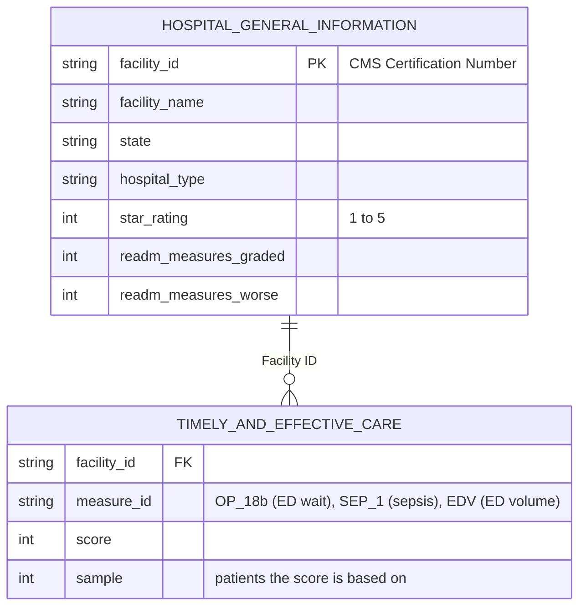

# Aldermere Health: Hospital Network ED Access & Quality Report

**Live dashboard:** [ED Wait Time by State (Tableau Public)](https://public.tableau.com/app/profile/danny.lin4647/viz/EDWaitTimeByState/Dashboard1)

## Client Background

Aldermere Health is a regional Medicare Advantage plan, a private insurer that provides
Medicare coverage to its members through a network of contracted hospitals and doctors.
The plan is preparing for its next hospital contracting cycle, including expansion into
new states. As part of that cycle, it intends to introduce a "preferred hospital" label in
its member provider directory to steer members toward recommended hospitals, and the
initial proposal is to award the label based on CMS hospital star ratings.

Two concerns prompted a closer look. Member Services has logged complaints about long
emergency department waits at some in-network hospitals, including highly rated ones. The
Quality team has flagged that hospital readmissions among members count against the
plan's own quality measures. The Network Management team, which manages the plan's
hospital contracts, commissioned an analysis of public CMS hospital data to test whether
star ratings are a sound basis for the label, and to identify what else should inform
contract reviews.

This analysis is guided by the following business questions:

1. Does a hospital's star rating reflect how quickly its emergency department sees patients?
2. What is the right benchmark for a hospital's ED performance: national, statewide, or its in-state peers?
3. Where is hospital readmission performance weakest?
4. What should the preferred-hospital label and contract reviews be based on?

Key insights and recommendations are structured around three core areas:

- **ED Access:** how long patients spend in the emergency department, from arrival until
  they are sent home (median minutes), and how busy the ED is (CMS's annual visit volume
  category, from low to very high). Long waits delay care and drive member complaints.
- **Quality:** the CMS overall star rating, a 1-to-5 summary of many hospital quality
  measures, and a sepsis care score, the share of sepsis patients who received the full
  recommended treatment.
- **Readmissions:** patients returning to the hospital within 30 days of discharge. CMS
  rates each hospital better than, no different from, or worse than the national average
  on up to 11 readmission measures. Readmissions matter to Aldermere because members'
  readmissions count against the plan's own quality measures.

*Aldermere Health is a fictional client. All hospital data is real, publicly published CMS data.*

## Data & Methodology

The analysis uses two CMS files, joined on each hospital's CMS Certification Number. Both
files are wide (38 and 16 columns, respectively); the diagram below shows only the fields
this project uses.

- **Sources:** CMS Hospital General Information (release dated July 22, 2026) and CMS
  Timely and Effective Care, Hospital (ED and sepsis measures, July 2024 to June 2025;
  ED volume, calendar year 2024).
- **Which hospitals count:** a hospital is included for a measure when CMS reports a
  score for it based on at least 30 patients. The same rule applies to every measure.
  4,073 hospitals have valid ED data; 4,064 of them appear in the hospital information file.
- **Data currency:** an older copy of the hospital information file was replaced with the
  current CMS release after 42% of hospitals were found to have different star ratings in
  the current file. Results based on the older file are not used anywhere in this report.
- **Tools:** SQL (SQLite) for all views and the scorecard, Python for statistics and
  charts, Tableau Public for the dashboard.
- **Where the work lives:** SQL views in [`sql/`](sql/) with their CSV outputs in
  [`outputs/`](outputs/); statistical detail, including the calculations behind these
  findings, in the [analysis notebook](notebook/cms_analysis.ipynb).

## Executive Summary

Star ratings do not tell Aldermere how quickly a hospital's emergency department sees
patients, and state averages hide most of the difference between hospitals. A preferred-
hospital label based on star rating alone would do nothing to steer members toward faster
EDs. Readmission performance, which affects the plan's own
quality measures, is weakest in four states. The label and contract reviews should weigh
ED access, quality and readmissions separately, with each hospital judged against similar
hospitals in its own state.

### 1. Star Ratings Don't Reflect ED Speed

- **Average ED wait is nearly the same at every star rating.** One-star hospitals average
  178 minutes; five-star hospitals average 175.
- **Five-star hospitals are no more likely to have fast EDs.** About 1 in 7 five-star
  hospitals has one of the fastest EDs in its state, while about 1 in 3 has one of the
  slowest, the same pattern as every other rating.
- **A star-rating-only label would not address the ED wait complaints.** Members steered to
  preferred hospitals would be just as likely to face long waits as members who weren't.

### 2. The Real Differences Are Within States

- **Most of the difference in ED wait is between hospitals in the same state.** Knowing
  which state a hospital is in explains only about a quarter of why its ED is fast or slow.
- **Gaps inside a state can be larger than gaps between states.** State averages range from
  114 minutes (North Dakota) to 330 (Washington, D.C.), but California's hospitals alone
  range from 70 to 464 minutes.
- **Busier EDs are slower, even within the same state.** Low-volume EDs average 22 minutes
  faster than their state's average; very-high-volume EDs average 30 minutes slower. ED
  volume accounts for about a quarter of the differences between hospitals in the same state.
- **Contract decisions need like-for-like comparisons.** A busy urban hospital will look
  slow next to a small rural one in the same state. Aldermere should compare hospitals with
  others in the same state that see a similar number of ED patients.

### 3. Readmission Problems Concentrate in Four States

- **New Jersey, Massachusetts, Florida and New York stand out.** Nationally, 12.8% of
  hospital readmission ratings are worse than average. New Jersey's rate is 23.0%, 1.8 times
  the national rate, and the other three are above 20%.
- **Utah, Idaho and South Dakota have the lowest rates**, at 0.8%, 2.5% and 2.6%.
- **These four states are where Aldermere's readmission risk is highest.** Members
  hospitalized there are the most likely to be treated at a hospital rated worse on
  readmissions.

### 4. Recommendations

- **Don't base the preferred-hospital label on star rating alone.** Add ED wait as a
  separate criterion and show it alongside star rating in the provider directory.
- **Compare each hospital with similar hospitals at contract review.** Use the hospital
  scorecard to compare hospitals within the same state and ED volume category, and flag
  those with the slowest EDs among their peers for discussion.
- **Focus readmission efforts where the problem concentrates.** Prioritize follow-up care
  for members discharged in the four highest-readmission states, and identify which
  conditions drive those ratings before designing programs.

## Insights Deep-Dive

### Star Rating vs. ED Access

The chart below splits each state's hospitals into four equal groups, from the fastest EDs
to the slowest, and shows where hospitals at each star rating land. If star rating tracked
ED speed, the five-star row would be mostly green. It isn't: every rating level looks
roughly the same, and five-star hospitals are slightly more likely than the others to have
one of the slowest EDs in their state.

For Aldermere, this means star rating and ED access have to be judged separately. A
hospital can earn five stars for strong performance on other quality measures and still
have one of the longest ED waits in its market, which is consistent with the complaints
Member Services has logged.

No rating reaches a quarter in the fastest group because many of the fastest EDs belong to
small rural hospitals that don't receive a star rating.

### ED Wait Within and Between States

Each box below covers the middle half of hospitals in that state, and the lines extend to
cover the middle 80%. The white line marks the typical (median) wait. Among the 12 states
with the most hospitals, typical waits range from 119 minutes in Kansas to 206 in New York.
But the spread inside each state is wide: in Georgia, the middle 80% of hospitals range from
98 to 254 minutes, a wider gap than the difference between Kansas and New York.

For Aldermere's expansion, this means state-level figures are a starting point, not an
answer. A state with long average waits still has hospitals with fast EDs, and a state with
short average waits still has slow ones. The choice between hospitals has to be made
hospital by hospital.

### ED Volume and Wait Time

CMS places each hospital's emergency department into one of four volume categories based on
how many patients it sees in a year. The chart below shows how much faster or slower
hospitals in each category are than the average hospital in their own state.

The pattern is steady: the busier the ED, the longer the wait. Low-volume EDs, mostly small
and rural, run 22 minutes faster than their state's average. Very-high-volume EDs run 30
minutes slower. The pattern holds even when small rural hospitals are set aside, so it is
not only a rural-versus-urban split. Volume accounts for about a quarter of the differences
between hospitals in the same state; the rest remains unexplained.

For Aldermere, this changes how hospitals should be compared. The large, busy hospitals the
plan most likely needs in its network will look slow against a statewide benchmark simply
because they are busy. Comparing each hospital with others of similar volume in the same
state separates hospitals that are slow for their size from hospitals that are simply busy.
The volume data shows an association, not a cause: busier EDs may also be larger, more
urban or differently staffed.

### Readmissions by State

Each bar shows the share of a state's hospital readmission ratings that are worse than the
national average. The dashed line marks the national rate of 12.8%.

The rates count individual ratings rather than whole hospitals. Labeling a whole hospital
"worse" whenever any one of its ratings is worse would make states with many small rural
hospitals look better than they are, because those hospitals are rated on fewer measures
and have fewer chances to be flagged.

Puerto Rico shows the highest rate (24.3%) but is based on only 70 ratings, so it is less
reliable than the states below it. Children's, psychiatric and several other hospital types
are not rated on readmissions.

## Recommendations

Aldermere should treat ED access and star rating as separate questions rather than letting
one stand in for the other. Star rating can remain part of the preferred-hospital label,
but ED wait should be a separate criterion, displayed next to star rating so members and
network staff can see both.

At contract review, each hospital should be compared with hospitals in the same state that
see a similar number of ED patients, rather than with state or national averages. The
[hospital scorecard](outputs/view6_hospital_scorecard.csv) is built for this: one row per
hospital showing its star rating, ED volume, ED wait, rank among hospitals in its state,
sepsis care score and readmission rate. It deliberately has no
single combined score, since deciding how much each measure should count is a decision for
the network team, not something the data can settle.

For readmissions, the plan should look first at members discharged from hospitals in New
Jersey, Massachusetts, Florida and New York, and prioritize follow-up care after discharge
there. Before designing a program, it should find out which conditions drive those
hospitals' ratings.

| Finding | What it means | Recommendation |
|---|---|---|
| Star rating does not reflect ED speed | Highly rated hospitals are not necessarily faster | Add ED wait as a separate criterion for the preferred-hospital label |
| Most ED wait differences are within states | State averages hide the differences that matter for contracting | Compare each hospital with others in its state using the scorecard |
| Busier EDs are slower, even within a state | Busy hospitals look worse against a statewide benchmark | Compare hospitals within the same state and ED volume category |
| Readmission problems concentrate in NJ, MA, FL, NY | Members discharged there carry the most readmission risk | Prioritize follow-up care after discharge in those states |

### What to Look at Next

- **What explains the rest of the within-state differences.** ED volume accounts for about a
  quarter. Hospital size, staffing and ownership are the next factors to test; this data
  shows the differences exist but does not explain them.
- **Which conditions drive readmission ratings.** CMS's summary file counts better and worse
  ratings but does not say which conditions they cover. Condition-level data would show
  where follow-up programs should focus.

## Limitations

- The findings describe where hospitals differ, not why.
- Star ratings combine many measures collected over different time periods, so they cannot
  be matched exactly to the July 2024 to June 2025 ED data.
- Rates for small groups are less reliable, including states with few hospitals and Puerto
  Rico's readmission rate. Hospitals are not placed into in-state groups in states with
  fewer than 10 hospitals.
- Children's hospitals are not scored on sepsis care, and long-term care hospitals do not
  report ED or sepsis measures.
- ED volume covers calendar year 2024, while ED wait covers July 2024 to June 2025. About 300
  hospitals in the scorecard have no reported volume category.
