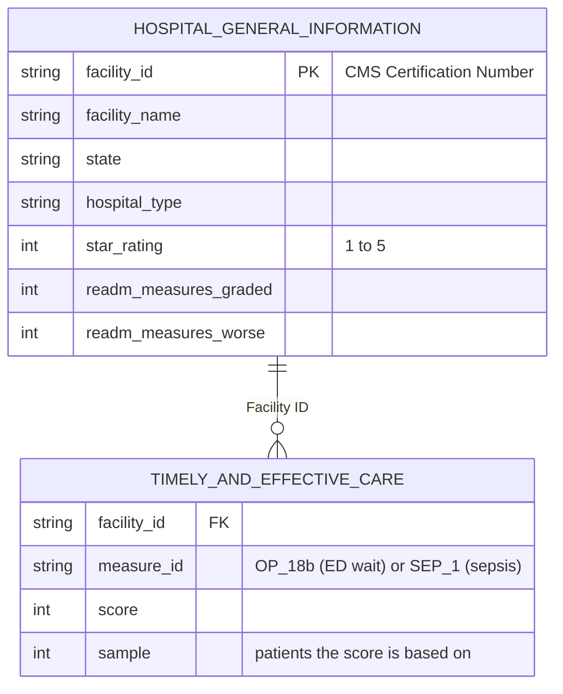

# Aldermere Health: Hospital Network ED Access & Quality Report

**Live dashboard:** [ED Wait Time by State (Tableau Public)](https://public.tableau.com/app/profile/danny.lin4647/viz/EDWaitTimeByState/Dashboard1)

## Client Background

Aldermere Health is a regional Medicare Advantage plan preparing for its next hospital
contracting cycle, including expansion into new states. As part of that cycle, the plan
intends to introduce a "preferred hospital" designation in its member provider directory,
and the initial proposal is to award it based on CMS hospital star ratings.

Two concerns prompted a closer look. Member Services has logged complaints about long
emergency department waits at some in-network hospitals, including highly rated ones.
And the Quality team has flagged that hospital readmissions among members count against
the plan's own quality measures. The Network Management team commissioned an analysis of
public CMS hospital data to test whether star ratings are a sound basis for the
designation, and to identify what else should inform contract reviews.

This analysis is guided by the following business questions:

1. Does a hospital's star rating reflect how quickly its emergency department sees patients?
2. What is the right benchmark for a hospital's ED performance: national, statewide, or its in-state peers?
3. Where is hospital readmission performance weakest?
4. What should the preferred-hospital designation and contract reviews be based on?

Key insights and recommendations are structured around three core areas:

- **ED Access:** median time from ED arrival to departure, in-state rank
- **Quality:** CMS overall star rating, sepsis care score
- **Readmissions:** share of graded readmission measures worse than the national average

*Aldermere Health is a fictional client. All hospital data is real, publicly published CMS data.*

## Data & Methodology

The analysis uses two CMS files, joined on each hospital's CMS Certification Number. Both
files are wide (38 and 16 columns); the diagram shows only the fields this project uses.

- **Sources:** CMS Hospital General Information (release dated July 22, 2026) and CMS
  Timely and Effective Care, Hospital (ED and sepsis measures, July 2024 to June 2025).
- **Which hospitals count:** a hospital is included for a measure when CMS reports a
  score for it based on at least 30 patients. The same rule applies to every measure.
  4,073 hospitals have valid ED data; 4,064 of them appear in the hospital information file.
- **Tools:** SQL (SQLite) for all views and the scorecard, Python for statistics and
  charts, Tableau Public for the dashboard.
- **Where the work lives:** SQL views in [`sql/`](sql/) with their CSV outputs in
  [`outputs/`](outputs/); statistical detail, including the correlation and variance
  calculations behind these findings, in the [analysis notebook](notebook/cms_analysis.ipynb).

## Executive Summary

Star ratings do not tell Aldermere how quickly a hospital's emergency department sees
patients, and state averages hide most of the difference between hospitals. A preferred-
hospital designation based on star rating alone would reward hospitals regardless of ED
access. Readmission performance, which affects the plan's own quality measures, is weakest
in a small group of states. The designation and contract reviews should look at ED access,
quality and readmissions as separate measures, each judged against in-state peers.

### 1. Star Ratings Don't Reflect ED Speed

- **Average ED wait barely changes with star rating.** Across 2,964 rated hospitals,
  one-star hospitals average 178 minutes and five-star hospitals average 175. The lowest
  average, 168 minutes, belongs to four-star hospitals.
- **Five-star hospitals are no more likely to have fast EDs.** Compared with other
  hospitals in their own state, 15% of five-star hospitals are in the fastest quarter and
  35% are in the slowest. Every rating level shows roughly the same mix.
- **An earlier result pointing the other way came from outdated data.** An older hospital
  information file suggested higher-rated hospitals had shorter waits. 42% of hospitals'
  ratings have changed since that file; with current ratings, the relationship disappears.

### 2. The Real Differences Are Within States

- **About three-quarters of the variation in ED wait is between hospitals in the same
  state.** Across 4,073 hospitals, 72.8% of the variation sits within states rather than
  between them.
- **Gaps inside a state can exceed gaps between states.** State averages range from 114
  minutes (North Dakota) to 330 (Washington, D.C.), but California's hospitals alone range
  from 70 to 464 minutes.
- **State-level benchmarks miss the comparisons that matter for contracting.** A network
  team choosing between hospitals in the same market needs to see how they compare with
  each other, which a state average can't show.

### 3. Readmission Problems Concentrate in a Few States

- **Nationally, 12.8% of graded readmission measures are worse than average.** In New
  Jersey (23.0%), Massachusetts (22.0%), Florida (21.4%) and New York (20.7%), the rate is
  close to double that.
- **The lowest rates are in Utah (0.8%), Idaho (2.5%) and South Dakota (2.6%).**
- **Counting measures, not hospitals, gives a fairer comparison.** Flagging a whole hospital
  as "worse" whenever any one measure is worse favors hospitals graded on fewer measures:
  hospitals graded on 1 measure were flagged 0.6% of the time, those graded on 11 measures
  77.8% of the time. That made states with many small rural hospitals look better than
  they are.

### 4. Recommendations

- **Don't base the preferred-hospital designation on star rating alone.** Add ED wait as a
  separate criterion and show it alongside star rating in the provider directory.
- **Benchmark each hospital against its in-state peers at contract review.** Use the
  hospital scorecard to flag hospitals in their state's slowest quarter for discussion.
- **Focus readmission efforts where the problem concentrates.** Prioritize post-discharge
  follow-up for members in the highest-readmission states, and identify which conditions
  drive those ratings before designing programs.

## Insights Deep-Dive

### Star Rating vs. ED Access

If star rating predicted ED speed, five-star hospitals would sit mostly in the fastest
quarter of their state. Instead, every rating level has about the same mix, and five-star
hospitals are slightly more likely than others to be in the slowest quarter. A member
directed to a five-star hospital is not, by that choice, being directed to faster
emergency care.

No rating level reaches 25% in the fastest quarter because hospitals without a star
rating, mostly small critical access hospitals, take up many of the fastest spots: 51% of
unrated hospitals fall in their state's fastest quarter.

This finding reversed during the project. An earlier version joined the 2024-25 ED data to
an older, undated hospital information file and appeared to show that higher-rated
hospitals had shorter waits. Of the 4,344 hospitals present in both files, 42% have a
different star rating in the current release. Once the current file replaced it, the
relationship disappeared.

### ED Wait Within and Between States

Among the 12 states with the most hospitals, median ED waits range from 119 minutes
(Kansas) to 206 minutes (New York). But the spread inside each state is wide: in Georgia,
the middle 80% of hospitals range from 98 to 254 minutes, a wider gap than the difference
between Kansas and New York. Each box below covers the middle half of hospitals in that
state; the lines extend to the middle 80%.

For a network team, this means the useful question is how a hospital compares with others
in the same market. State averages, including the state map in this project's dashboard,
show where waits are long overall but hide which hospitals within a state are driving it.

### Readmissions by State

CMS grades hospitals on up to 11 readmission measures, each rated better than, no different
from, or worse than the national average. 4,264 hospitals are graded on at least one;
children's, psychiatric and several other hospital types are not graded.

The same states rank highest and lowest whether readmissions are counted by measure or by
hospital, but the measure-level rate gives a more accurate sense of the size of the gap.
Puerto Rico shows the highest rate (24.3%) but is based on only 70 graded measures, so it
is less reliable than the states below it.

## Recommendations

Aldermere should treat ED access and star rating as separate questions rather than letting
one stand in for the other. Star rating can remain part of the preferred-hospital
designation, but ED wait should be a separate criterion, displayed next to star rating so
members and network staff can see both.

At contract review, each hospital should be compared with its in-state peers rather than
with state or national averages. The [hospital scorecard](outputs/view6_hospital_scorecard.csv)
is built for this: one row per hospital showing its star rating, ED wait, rank and quarter
among hospitals in its state, sepsis care score and readmission rate. It deliberately has
no single combined score, since weighting these measures against each other is a decision
for the network team, not something the data can settle.

For readmissions, the plan should look first at members discharged from hospitals in New
Jersey, Massachusetts, Florida and New York, and prioritize post-discharge follow-up there.
Before designing a program, it should find out which conditions drive those hospitals'
ratings.

| Finding | What it means | Recommendation |
|---|---|---|
| Star rating does not reflect ED speed | Highly rated hospitals are not necessarily faster | Add ED wait as a separate criterion for the preferred-hospital designation |
| Most ED wait variation is within states | State averages hide the differences that matter for contracting | Compare each hospital to in-state peers using the scorecard |
| Readmission problems concentrate in NJ, MA, FL, NY | Members discharged there carry the most readmission risk | Prioritize post-discharge follow-up in those states |

### What to Look at Next

- **Why hospitals in the same state differ so much.** Hospital size, ED volume and ownership
  are the first factors to test. This data shows the differences exist; it does not
  explain them.
- **Which conditions drive readmission ratings.** CMS's summary file counts better and worse
  ratings but does not say which conditions they cover. Condition-level data would show
  where follow-up programs should focus.

## Limitations

- The findings describe where hospitals differ, not why.
- Star ratings combine many measures collected over different time periods, so they cannot
  be matched exactly to the July 2024 to June 2025 ED data.
- Rates for small groups are less reliable, including states with few hospitals and Puerto
  Rico's readmission rate. In-state quarters are not assigned in states with fewer than 10
  hospitals.
- Children's hospitals are not scored on sepsis care, and long-term care hospitals do not
  report ED or sepsis measures.
