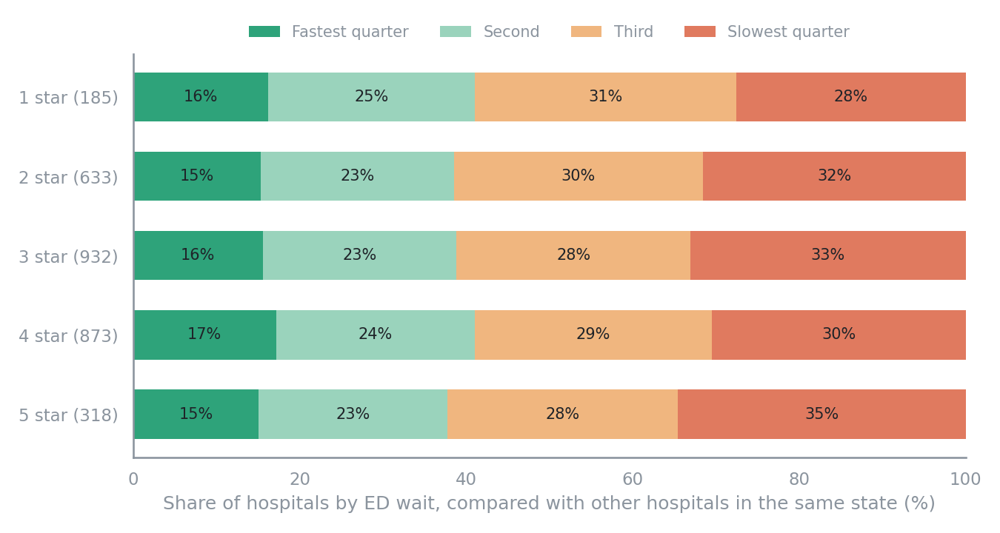
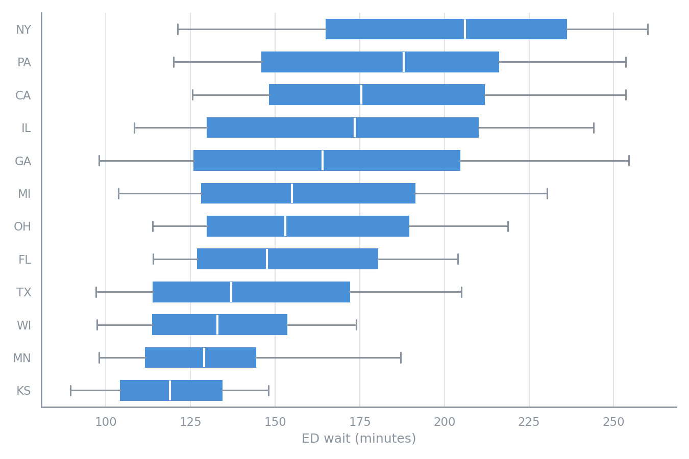
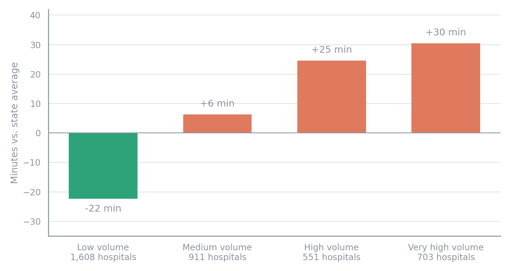
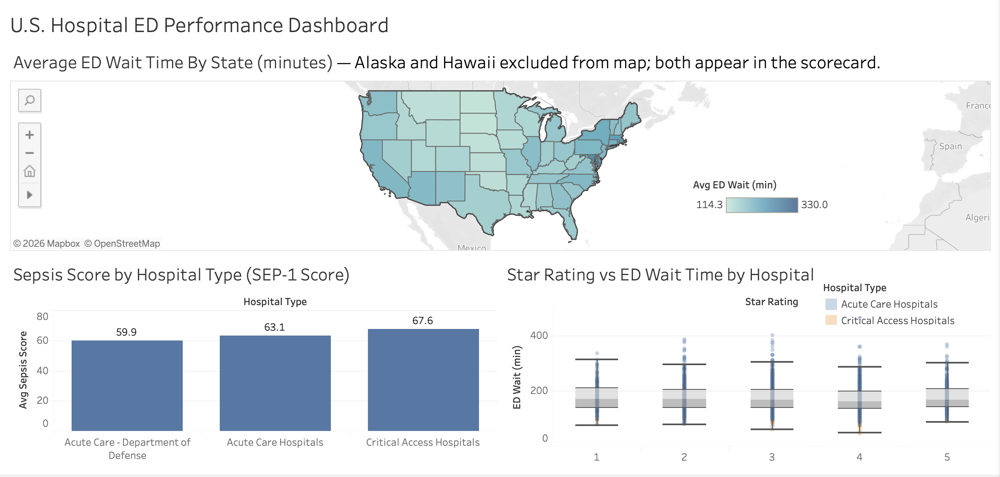
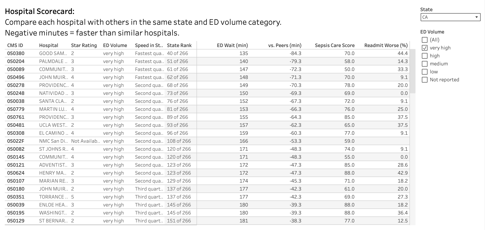
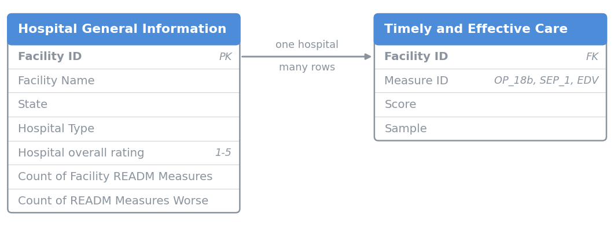

# Aldermere Health: Hospital Network ED Access & Quality Report

An analysis of public CMS data for 4,000+ U.S. hospitals, written for the network management
team of Aldermere Health, a fictional Medicare Advantage plan. Aldermere plans to label some
hospitals as "preferred" based on CMS star ratings, while members are complaining about long
emergency department (ED) waits. This analysis tests whether star ratings reflect ED access,
how hospitals should be benchmarked, and where hospital readmission ratings are weakest.

**Live dashboard:** [Hospital ED Access & Quality Dashboard (Tableau Public)](https://public.tableau.com/app/profile/danny.lin4647/viz/EDWaitTimeByState/Overview)

## Executive Summary

Star ratings do not tell Aldermere how quickly a hospital's emergency department sees
patients, and which state a hospital is in explains only 27% of the variation in ED wait. A preferred-
hospital label based on star rating alone would not steer members toward faster EDs. Hospital readmission ratings, which matter to the plan's costs and quality measures,
are weakest in four states that warrant closer review. The label and contract reviews should weigh
ED access, quality and readmissions separately, with each hospital judged against similar
hospitals in its own state.

### 1. Star Ratings Don't Reflect ED Speed

- **Average ED wait is nearly the same at every star rating.** One-star hospitals average
  178 minutes; five-star hospitals average 175.
- **Five-star hospitals are no more likely to have fast EDs.** About 1 in 7 five-star
  hospitals has one of the fastest EDs in its state, while about 1 in 3 has one of the
  slowest, the same pattern as every other rating.
- **A star-rating-only label would not address the ED wait complaints.** Members steered to
  preferred hospitals would be just as likely to face long waits as members who weren't.

### 2. The Real Differences Are Within States

- **Most of the difference in ED wait is between hospitals in the same state.** Knowing
  which state a hospital is in accounts for only 27% of the variation in ED wait; the other
  73% is between hospitals in the same state.
- **Gaps inside a state can be larger than gaps between states.** State averages range from
  114 minutes (North Dakota) to 330 (Washington, D.C.), but California's hospitals alone
  range from 70 to 464 minutes.
- **Busier EDs are slower, even within the same state.** Low-volume EDs average 22 minutes
  faster than their state's average; very-high-volume EDs average 30 minutes slower. ED
  volume accounts for about 25% of the variation in ED wait within states.
- **Contract decisions need like-for-like comparisons.** A busy urban hospital will look
  slow next to a small rural one in the same state. Aldermere should compare hospitals with
  others in the same state that see a similar number of ED patients.

### 3. Readmission Ratings Are Weakest in Four States

- **New Jersey, Massachusetts, Florida and New York stand out.** Nationally, 12.8% of
  hospital readmission ratings are worse than average. New Jersey's rate is 23.0%, 1.8 times
  the national rate, and the other three are above 20%.
- **Utah, Idaho and South Dakota have the lowest rates**, at 0.8%, 2.5% and 2.6%.
- **These four states warrant the closest review.** They have the highest share of
  worse-than-average hospital readmission ratings. Whether Aldermere's own members follow
  the same pattern requires the plan's claims data.

### 4. Recommendations

- **Don't base the preferred-hospital label on star rating alone.** Add ED wait as a
  separate criterion and show it alongside star rating in the provider directory.
- **Compare each hospital with similar hospitals at contract review.** Use the hospital
  scorecard to compare hospitals within the same state and ED volume category, and flag
  those with the slowest EDs among their peers for discussion.
- **Review readmissions in those four states first.** Use Aldermere's own claims data to
  check whether members there are readmitted more often, and which conditions are involved,
  before deciding whether targeted follow-up after discharge is warranted.

## Client Background

Aldermere Health is a regional Medicare Advantage plan, a private insurer that provides
Medicare coverage to its members through a network of contracted hospitals and doctors.
The plan is preparing for its next hospital contracting cycle, including expansion into
new states. As part of that cycle, it intends to introduce a "preferred hospital" label in
its member provider directory to steer members toward recommended hospitals, and the
initial proposal is to award the label based on CMS hospital star ratings.

Two concerns prompted a closer look. Member Services has logged complaints about long
emergency department waits at some in-network hospitals, including highly rated ones. The
Quality team has flagged that hospital readmissions among members count against the
plan's own quality measures. The Network Management team, which manages the plan's
hospital contracts, commissioned an analysis of public CMS hospital data to test whether
star ratings are a sound basis for the label, and to identify what else should inform
contract reviews.

This analysis is guided by the following business questions:

1. Does a hospital's star rating reflect how quickly its emergency department sees patients?
2. What is the right benchmark for a hospital's ED performance: national, statewide, or its in-state peers?
3. Where is hospital readmission performance weakest?
4. What should the preferred-hospital label and contract reviews be based on?

Key insights and recommendations are structured around three core areas:

- **ED Access:** how long patients spend in the emergency department, from arrival until
  they are sent home (median minutes), and how busy the ED is (CMS's annual visit volume
  category, from low to very high). Long waits delay care and drive member complaints.
- **Quality:** the CMS overall star rating, a 1-to-5 summary of many hospital quality
  measures, and a sepsis care score, the share of sepsis patients who received the full
  recommended treatment.
- **Readmissions:** patients returning to the hospital within 30 days of discharge. CMS
  rates each hospital better than, no different from, or worse than the national average
  on up to 11 readmission measures. Readmissions matter to Aldermere because members'
  readmissions count against the plan's own quality measures.

*Aldermere Health is a fictional client. All hospital data is real, publicly published CMS data.*

## Insights Deep-Dive

### Star Rating vs. ED Access

The chart below splits each state's hospitals into four equal groups, from the fastest EDs
to the slowest, and shows where hospitals at each star rating land. If star rating tracked
ED speed, the five-star row would be mostly green. It isn't: every rating level looks
roughly the same, and five-star hospitals are slightly more likely than the others to have
one of the slowest EDs in their state.

For Aldermere, this means star rating and ED access have to be judged separately. A
hospital can earn five stars for strong performance on other quality measures and still
have one of the longest ED waits in its market, which is consistent with the complaints
Member Services has logged.

No rating reaches a quarter in the fastest group because many of the fastest EDs belong to
small rural hospitals that don't receive a star rating.

### ED Wait Within and Between States

Each box below covers the middle half of hospitals in that state, and the lines extend to
cover the middle 80%. The white line marks the typical (median) wait. Among the 12 states
with the most hospitals, typical waits range from 119 minutes in Kansas to 206 in New York.
But the spread inside each state is wide: in Georgia, the middle 80% of hospitals range from
98 to 254 minutes, a wider gap than the difference between Kansas and New York.

For Aldermere's expansion, this means state-level figures are a starting point, not an
answer. A state with long average waits still has hospitals with fast EDs, and a state with
short average waits still has slow ones. The choice between hospitals has to be made
hospital by hospital.

### ED Volume and Wait Time

CMS places each hospital's emergency department into one of four volume categories based on
how many patients it sees in a year. The chart below shows how much faster or slower
hospitals in each category are than the average hospital in their own state.

The pattern is steady: the busier the ED, the longer the wait. Low-volume EDs, mostly small
and rural, run 22 minutes faster than their state's average. Very-high-volume EDs run 30
minutes slower. The pattern holds even when small rural hospitals are set aside, so it is
not only a rural-versus-urban split. Volume accounts for about 25% of the variation in ED wait
within states; the other 75% remains unexplained.

For Aldermere, this changes how hospitals should be compared. The large, busy hospitals the
plan most likely needs in its network will look slow against a statewide benchmark simply
because they are busy. Comparing each hospital with others of similar volume in the same
state separates hospitals that are slow for their size from hospitals that are simply busy.
The volume data shows an association, not a cause: busier EDs may also be larger, more
urban or differently staffed.

### Readmissions by State

Each bar shows the share of a state's hospital readmission ratings that are worse than the
national average. The dashed line marks the national rate of 12.8%.

The rates count individual ratings rather than whole hospitals. Labeling a whole hospital
"worse" whenever any one of its ratings is worse would make states with many small rural
hospitals look better than they are, because those hospitals are rated on fewer measures
and have fewer chances to be flagged.

Puerto Rico shows the highest rate (24.3%) but is based on only 70 ratings, so it is less
reliable than the states below it. Children's, psychiatric and several other hospital types
are not rated on readmissions.

## Recommendations

Based on the analysis, Aldermere should not base its preferred-hospital label on star rating
alone. Star ratings summarize many quality measures, but they say almost nothing about ED
access. Five-star hospitals are at least as likely as other hospitals to have one of the
slowest EDs in their state. A label built on star ratings alone would not address the ED
access problem behind Member Services' complaints. ED wait should be added as a separate
criterion and shown next to the star rating in the provider directory, so members choosing
a hospital can see both. Star rating can remain part of the label, but it shouldn't fill in
for ED access.

Contract reviews should also change how hospitals are benchmarked. Most of the variation in
ED wait is between hospitals in the same state, and part of it is associated with how busy
each ED is. Comparing every hospital with a statewide average can make the large, busy
hospitals the plan most likely needs to meet its access requirements look slow next to small
rural hospitals that see far fewer patients. Network managers should instead compare each
hospital with others in the same state and ED volume category, using the
[hospital scorecard](outputs/view6_hospital_scorecard.csv). The scorecard shows each
hospital's star rating, ED volume, ED wait, in-state rank, sepsis score and readmission
rate, so managers can flag hospitals that are slow for their size in contract discussions.
The scorecard deliberately has no single combined score: how much each measure should count
is a decision for the network team and not something the data can answer alone.

Readmission review should start where hospital ratings are weakest. In New Jersey,
Massachusetts, Florida and New York, more than 20% of hospital readmission ratings are worse
than the national average; across all states, the figure is 12.8%. These ratings describe
each hospital's Medicare patients overall, so they point Aldermere to where to look, not to
what its own members experience. Because members' readmissions add to the plan's costs and
count against its quality measures, Aldermere should use its own claims data to check whether
members discharged from hospitals in these states are readmitted more often. If the pattern
holds, Aldermere could then test targeted follow-up after discharge, such as a check-in call,
an early primary care appointment and a medication review.

Finally, Aldermere should investigate what drives the differences this analysis can identify
but not explain. ED volume accounts for about 25% of the variation in ED wait within states;
the other 75% is unexplained. Hospital size, ownership and location are logical next factors
to test, and ownership is already in the scorecard. For readmissions, CMS publishes
condition-level readmission rates that could show which conditions, such as heart failure or
pneumonia, contribute to each hospital's worse ratings. Future analysis should combine these
public benchmarks with the plan's own claims data, member complaint records and contract
terms to confirm whether the same patterns hold for Aldermere's members.

## Dashboard

The [Tableau Public dashboard](https://public.tableau.com/app/profile/danny.lin4647/viz/EDWaitTimeByState/Overview)
has two pages. **Overview** maps average ED wait by state and shows sepsis care by hospital
type and ED wait by star rating; clicking a state on the map filters the star rating chart.

**Hospital Scorecard** puts the recommendation into practice: pick a state and ED volume
category to see each hospital's rank, its ED wait compared with similar hospitals, and its
quality and readmission measures.

## Data & Methodology

The analysis joins two CMS files on each hospital's CMS Certification Number (Facility ID).
The diagram shows only the fields used, out of 38 and 16 columns in the full files. Both
files are published on the [CMS Provider Data Catalog](https://data.cms.gov/provider-data/topics/hospitals).

| Source | Used for | Period covered |
|---|---|---|
| [Hospital General Information](https://data.cms.gov/provider-data/dataset/xubh-q36u) (last modified July 22, 2026; released August 13, 2026) | Star rating, hospital type, readmission ratings | Varies by measure |
| Timely and Effective Care, Hospital (May 13, 2026 release) | ED wait (OP_18b), sepsis care (SEP_1) | July 2024 to June 2025 |
| Timely and Effective Care, Hospital (May 13, 2026 release) | ED volume (EDV) | Calendar year 2024 |

- **Inclusion rule:** a hospital counts for a measure when CMS's score is based on at least
  30 patients. 4,073 hospitals have valid ED data; 4,064 of them match the hospital file.
- **Data currency:** star ratings were checked against the current CMS release before
  analysis. An older copy of the hospital file differed for 42% of hospitals and was
  replaced.
- **Tools and files:** SQL (SQLite) in [`sql/`](sql/), with outputs in [`outputs/`](outputs/)
  and data quality checks in [`tests/`](tests/); Python in the
  [analysis notebook](notebook/cms_analysis.ipynb); Tableau Public for the dashboard.

## Limitations

- The findings describe where hospitals differ, not why.
- CMS's ratings describe each hospital's Medicare patients overall, not Aldermere's members.
- The measures cover different periods: ED wait and sepsis care run from July 2024 to June
  2025, ED volume covers calendar year 2024, and star ratings and readmission ratings
  combine measures collected over several different periods. They cannot be matched exactly.
- Rates for small groups are less reliable, including states with few hospitals and Puerto
  Rico's readmission rate. Hospitals are not placed into in-state groups in states with
  fewer than 10 hospitals, and 31 hospitals have fewer than 3 same-state, same-volume peers,
  so their comparison with similar hospitals means little.
- Coverage gaps: 9 hospitals with ED data are missing from the hospital file, 300 hospitals
  in the scorecard have no ED volume category, children's hospitals are not scored on sepsis
  care, and long-term care hospitals do not report ED or sepsis measures.
